<picture>
  <source media="(prefers-color-scheme: dark)" srcset="./assets/hero-dark.svg">
  <source media="(prefers-color-scheme: light)" srcset="./assets/hero-light.svg">
  
</picture>

  <a href="https://github.com/Anthony-Pan">GitHub</a>
  &nbsp;·&nbsp;
  <a href="https://www.onyx-lab.com/builder">The builder</a>

 

  <picture>
    <source media="(prefers-color-scheme: dark)" srcset="https://github-readme-stats.vercel.app/api?username=Anthony-Pan&amp;show_icons=true&amp;hide_border=true&amp;rank_icon=github&amp;bg_color=050912&amp;title_color=58D6FF&amp;text_color=91A0BE&amp;icon_color=A361EB">
    <source media="(prefers-color-scheme: light)" srcset="https://github-readme-stats.vercel.app/api?username=Anthony-Pan&amp;show_icons=true&amp;hide_border=true&amp;rank_icon=github&amp;bg_color=F4F3EC&amp;title_color=006C8F&amp;text_color=556078&amp;icon_color=6737C7">
    
  </picture>
  <picture>
    <source media="(prefers-color-scheme: dark)" srcset="https://github-readme-stats.vercel.app/api/top-langs/?username=Anthony-Pan&amp;layout=compact&amp;langs_count=8&amp;hide_border=true&amp;bg_color=050912&amp;title_color=58D6FF&amp;text_color=91A0BE">
    <source media="(prefers-color-scheme: light)" srcset="https://github-readme-stats.vercel.app/api/top-langs/?username=Anthony-Pan&amp;layout=compact&amp;langs_count=8&amp;hide_border=true&amp;bg_color=F4F3EC&amp;title_color=006C8F&amp;text_color=556078">
    
  </picture>

 

<picture>
  <source media="(prefers-color-scheme: dark)" srcset="./assets/projects-dark.svg">
  <source media="(prefers-color-scheme: light)" srcset="./assets/projects-light.svg">
  
</picture>

  <a href="https://github.com/Anthony-Pan/CleanYourMac">CleanYourMac</a>
  &nbsp;·&nbsp;
  <a href="https://github.com/Anthony-Pan/dotfiles">dotfiles</a>
  &nbsp;·&nbsp;
  <a href="https://github.com/Anthony-Pan/acorn">acorn</a>

<picture>
  <source media="(prefers-color-scheme: dark)" srcset="./assets/snake-dark.svg">
  <source media="(prefers-color-scheme: light)" srcset="./assets/snake-light.svg">
  
</picture>

