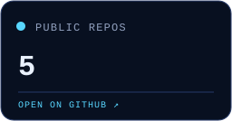
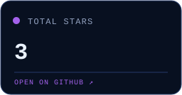
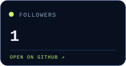

<picture>
  <source media="(prefers-color-scheme: dark)" srcset="./assets/hero-dark.svg">
  <source media="(prefers-color-scheme: light)" srcset="./assets/hero-light.svg">
  
</picture>

 

  <a href="https://github.com/Anthony-Pan?tab=repositories">
    <picture>
      <source media="(prefers-color-scheme: dark)" srcset="./assets/pulse-repositories-dark.svg">
      <source media="(prefers-color-scheme: light)" srcset="./assets/pulse-repositories-light.svg">
      
    </picture>
  </a>
  <a href="https://github.com/Anthony-Pan?tab=repositories&amp;sort=stargazers">
    <picture>
      <source media="(prefers-color-scheme: dark)" srcset="./assets/pulse-stars-dark.svg">
      <source media="(prefers-color-scheme: light)" srcset="./assets/pulse-stars-light.svg">
      
    </picture>
  </a>
  <a href="https://github.com/Anthony-Pan/followers">
    <picture>
      <source media="(prefers-color-scheme: dark)" srcset="./assets/pulse-followers-dark.svg">
      <source media="(prefers-color-scheme: light)" srcset="./assets/pulse-followers-light.svg">
      
    </picture>
  </a>
  <a href="https://github.com/Anthony-Pan/following">
    <picture>
      <source media="(prefers-color-scheme: dark)" srcset="./assets/pulse-following-dark.svg">
      <source media="(prefers-color-scheme: light)" srcset="./assets/pulse-following-light.svg">
      
    </picture>
  </a>

 

  <a href="https://github.com/Anthony-Pan/CleanYourMac">
    <picture>
      <source media="(prefers-color-scheme: dark)" srcset="./assets/project-cleanyourmac-dark.svg">
      <source media="(prefers-color-scheme: light)" srcset="./assets/project-cleanyourmac-light.svg">
      
    </picture>
  </a>
  <a href="https://github.com/Anthony-Pan/acorn">
    <picture>
      <source media="(prefers-color-scheme: dark)" srcset="./assets/project-acorn-dark.svg">
      <source media="(prefers-color-scheme: light)" srcset="./assets/project-acorn-light.svg">
      
    </picture>
  </a>

<picture>
  <source media="(prefers-color-scheme: dark)" srcset="./assets/snake-dark.svg">
  <source media="(prefers-color-scheme: light)" srcset="./assets/snake-light.svg">
  
</picture>
