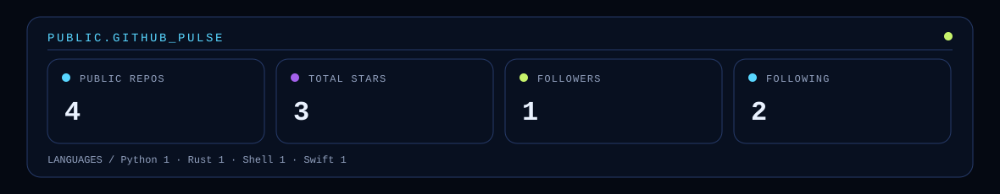

<picture>
  <source media="(prefers-color-scheme: dark)" srcset="./assets/hero-dark.svg">
  <source media="(prefers-color-scheme: light)" srcset="./assets/hero-light.svg">
  
</picture>

  <a href="https://github.com/Anthony-Pan">GitHub</a>
  &nbsp;·&nbsp;
  <a href="https://www.onyx-lab.com/builder">The builder</a>

 

  <picture>
    <source media="(prefers-color-scheme: dark)" srcset="./assets/pulse-dark.svg">
    <source media="(prefers-color-scheme: light)" srcset="./assets/pulse-light.svg">
    
  </picture>

 

  <a href="https://github.com/Anthony-Pan/CleanYourMac">
    <picture>
      <source media="(prefers-color-scheme: dark)" srcset="./assets/project-cleanyourmac-dark.svg">
      <source media="(prefers-color-scheme: light)" srcset="./assets/project-cleanyourmac-light.svg">
      
    </picture>
  </a>
  <a href="https://github.com/Anthony-Pan/acorn">
    <picture>
      <source media="(prefers-color-scheme: dark)" srcset="./assets/project-acorn-dark.svg">
      <source media="(prefers-color-scheme: light)" srcset="./assets/project-acorn-light.svg">
      
    </picture>
  </a>

<picture>
  <source media="(prefers-color-scheme: dark)" srcset="./assets/snake-dark.svg">
  <source media="(prefers-color-scheme: light)" srcset="./assets/snake-light.svg">
  
</picture>
